### 📦 A happy little sandbox for not-so-happy files.

## 📖 Introduction
**pokiSEC** is a lightweight, containerized sandbox designed for safe dynamic malware analysis. It uses **QEMU** and **Docker** to build a completely isolated Windows VM that streams directly to your browser tab.

Safely detonate malware, test suspicious executables, or analyze phishing links. When you're done, just close the container—**poof!** The entire environment is wiped clean, leaving no trace on your host machine.

---

## 🏗 Architecture
pokiSEC leverages kernel-level virtualization (KVM) passed through a Docker container to achieve near-native performance for the Windows guest, while keeping the network stack isolated.

```mermaid
graph LR
    %% Styling
    classDef container fill:#0f172a,stroke:#38bdf8,stroke-width:2px,color:#fff,rx:5px;
    classDef innerBox fill:#1e293b,stroke:#0ea5e9,stroke-width:1px,color:#fff,rx:5px,stroke-dasharray: 5 5;
    classDef malware fill:#ef4444,stroke:#7f1d1d,stroke-width:2px,color:#fff,rx:5px;
    classDef component fill:#3b82f6,stroke:#1d4ed8,stroke-width:2px,color:#fff,rx:5px;
    classDef user fill:#22c55e,stroke:#14532d,stroke-width:2px,color:#fff;

    %% External User
    User([👤 User]) -->|:8080| Web[🌐 Web UI]

    %% Main Docker Container
    subgraph Docker ["📦 Docker Container"]
        direction LR
        Web --> QEMU[⚙️ QEMU]
        QEMU --> KVM[🔌 KVM]
        
        %% The Nested Box You Wanted (Restored)
        subgraph Guest ["🪟 Windows Environment"]
            direction TB
            QEMU --> WinVM[💻 Win 10]
            WinVM -->|Executes| Malware[🦠 Malware]
        end
    end

    %% Logic Flow
    Malware -.-> Snapshot[📸 Snap]
    Reset[🛑 Stop] -->|Reverts| Snapshot

    %% Apply Styles
    class Docker container;
    class Guest innerBox;
    class Malware,Snapshot malware;
    class WinVM,QEMU,KVM,Web component;
    class User user;
```

